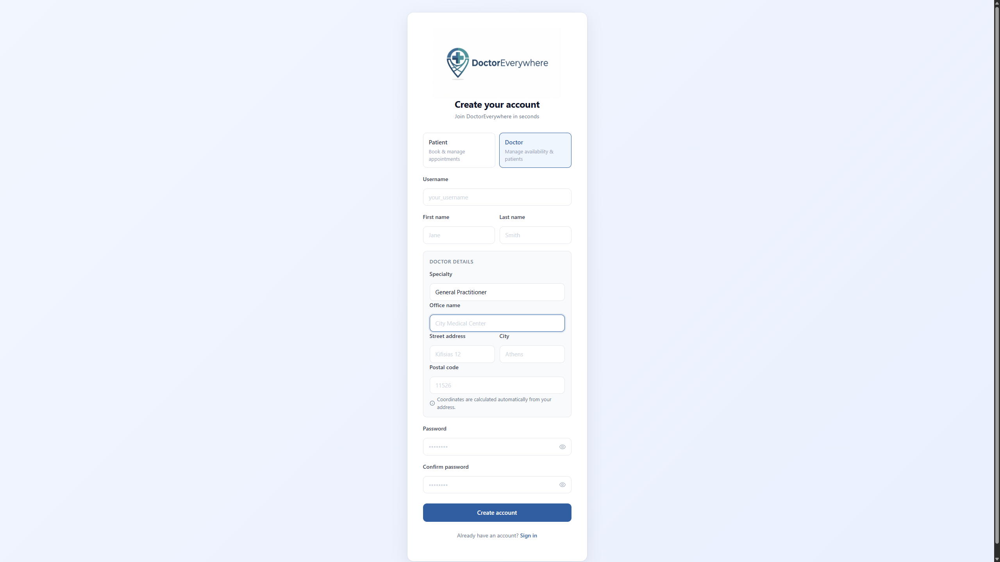
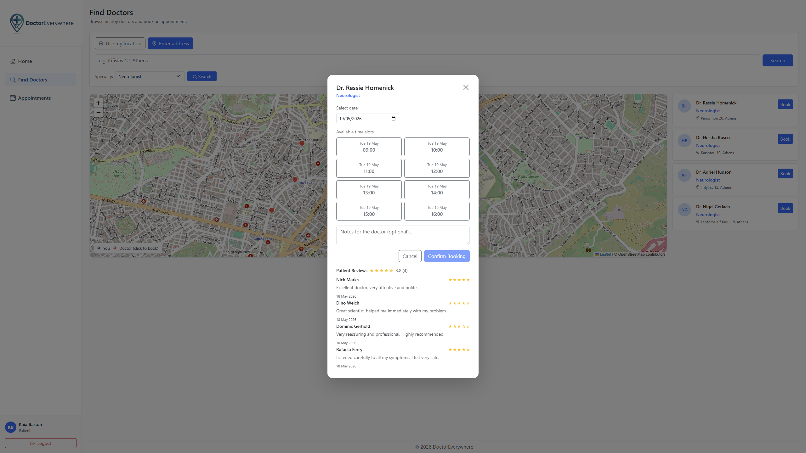
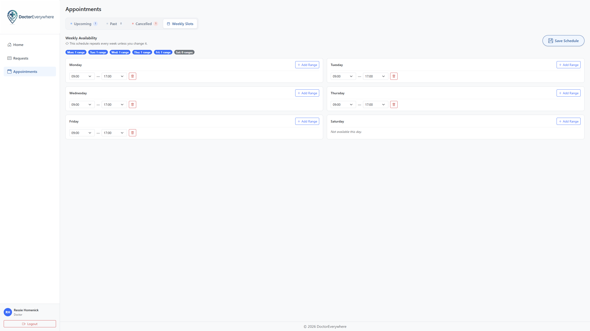

# DoctorEverywhere Frontend

## Project overview
DoctorEverywhere Frontend is an Angular SPA for a location-aware doctor/patient appointment platform,
with role-specific areas (patient, doctor, manager).

##  Features

### Role-Based Portals & Access Control
- **Patient Portal**: Register/login, search for nearby doctors by specialty, select appointment slots, leave ratings and comments, view bookings, and delete account.
- **Doctor Portal**: Manage professional profiles, set availability ranges, approve or reject incoming patient requests, and delete account.

### Interactive Search & Map Integration
- Live geolocation-based doctor discovery.
- Interactive mapping powered by **Leaflet** to visualize clinics and offices instantly.

### Advanced Slot Scheduling
- Dynamic slot booking for patients.
- Flat weekly shift allocation for doctors to set their schedules efficiently.

---

     
## Contributors
| Name |
|------|
| Maria-Eleni Kosma |
| Dimitrios Loukrezis |
| Periklis Tsaousis |
| Marios Tzanos |

## Tech stack (Frontend)
[](https://angular.dev/)
[](https://www.typescriptlang.org/)
[](https://getbootstrap.com/)
[](https://leafletjs.com/)
- **Framework**: Angular 21 (utilizing Standalone components for streamlined architecture).
- **Styling**: Bootstrap 5.3 + Bootstrap Icons for modern, responsive layouts.
- **State Management**: Reactive RxJS observables via unified service architectures.
- **Map rendering**: Leaflet Maps with TypeScript types.
- **Authentication**: Stateless client-side decoding using `jwt-decode`.

## Key directories 
```
src/app/
├── core/          # Guards, interceptors, app layout shell
├── shared/        # shared models and services used across features 
├── features/      # feature areas and route configs for auth/patient/doctor/manager 
│   └── [feature]/
│       ├── routes.ts
│       ├── services/    # All HTTP calls for this domain
│       ├── models/      # Types specific to this domain
│       └── [page]/
│           └── components/ 
└── environments/  # API URL config
```

## Installation & Local Setup

Get the local development server up and running in a few simple steps:

### 1. Prerequisites
Ensure you have **Node.js** (v18+ recommended) and **npm** installed on your system.

### 2. Install Dependencies
Navigate to the project subdirectory and install the required npm packages:
```bash
cd doctor_everywhere
npm install
```

### 3. Start Development Server
Launch the Angular development server:
```bash
npm run start
```
Once the compilation completes, navigate to `http://localhost:4200/` in your browser. The application supports Hot Module Replacement (HMR) and will auto-reload on file changes.

---

## Pictures
**Create Account**



**Appointment Slots**



**Working Schedule**



---
## Additional documentation
-  - patterns and conventions observed in this codebase

